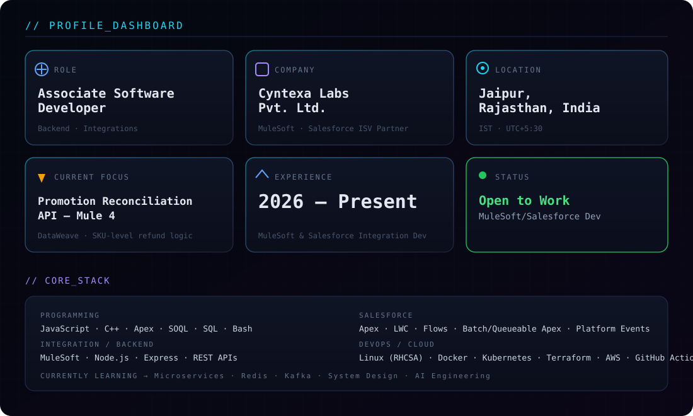
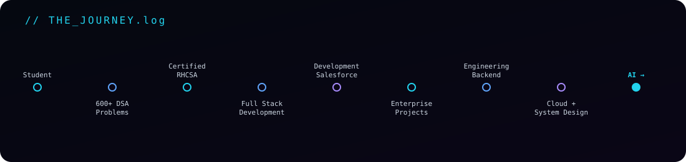
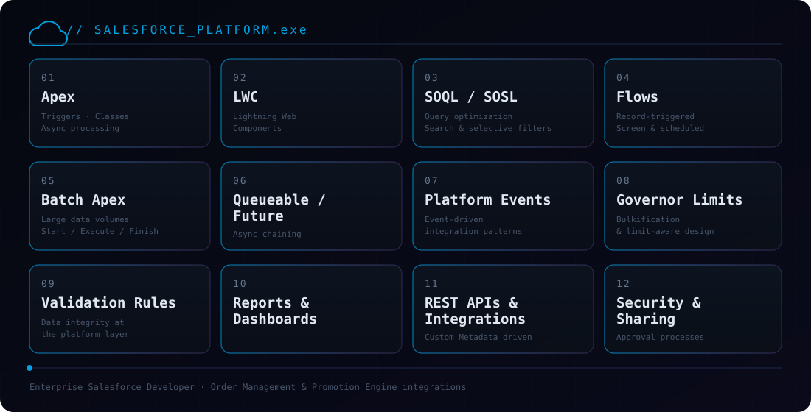
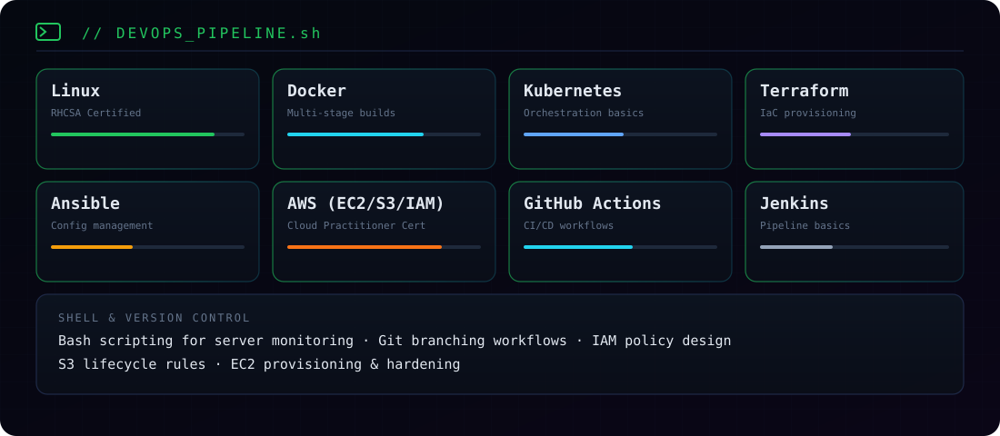
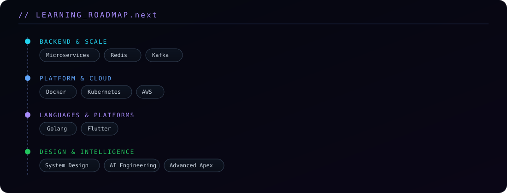
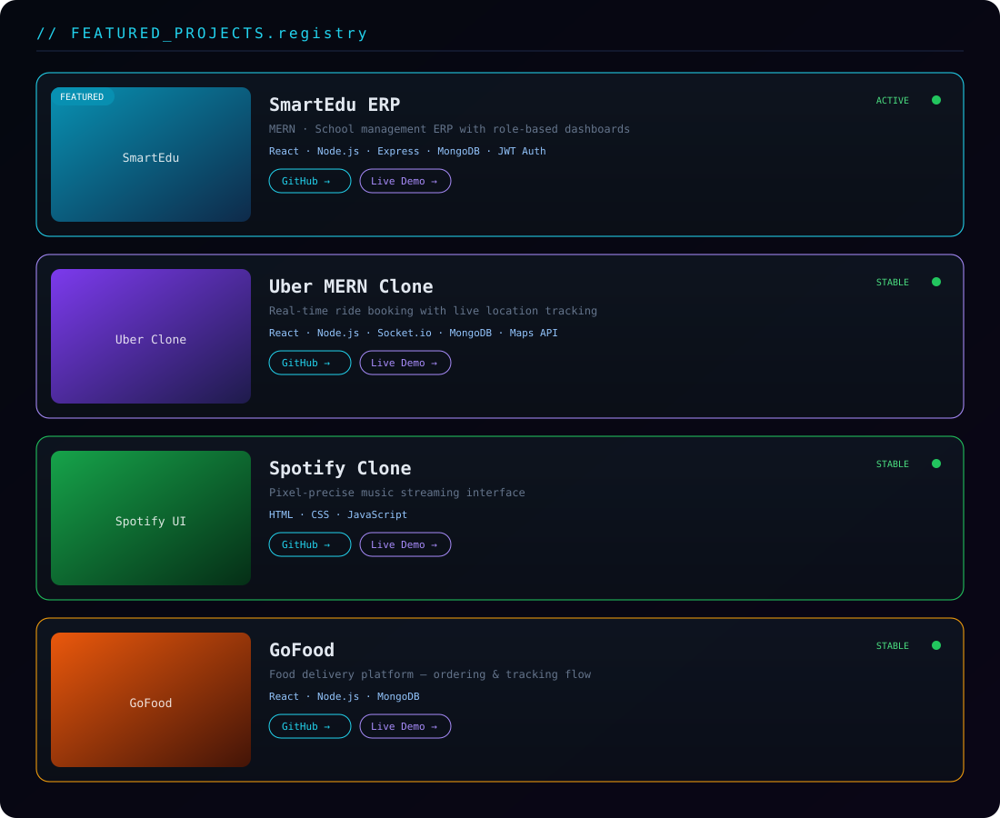
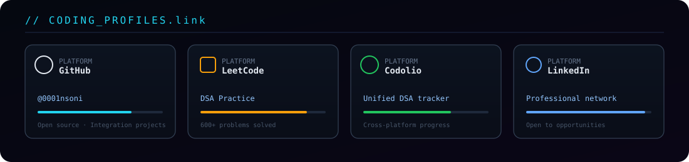

 

 

 

## `~/salesforce` — enterprise platform work

 

## `~/devops` — infrastructure &amp; automation

 

## `~/roadmap` — what's compiling next

 

## `~/projects` — featured builds

<strong>More in the registry →</strong>

 

| Project | Stack | Link |
|---|---|---|
| Docker 3-Tier Deployment | Docker · Nginx · Node.js · MongoDB | [github.com/0001nsoni](https://github.com/0001nsoni) |
| Linux Monitoring Script | Bash · Cron · Linux | [github.com/0001nsoni](https://github.com/0001nsoni) |
| Portfolio Website | React · Tailwind CSS · Vercel | [Live →](https://portfolio-neeraj-l1wi-4l5yoso6y-0001nsonis-projects.vercel.app/) |

 

## `~/profiles` — find me elsewhere

<code>[ <a href="https://github.com/0001nsoni"><b>GitHub</b></a> ]</code> &nbsp;
<code>[ <a href="https://linkedin.com/in/neeraj-soni"><b>LinkedIn</b></a> ]</code> &nbsp;
<code>[ <a href="https://codolio.com/profile/NeerajSoni"><b>Codolio</b></a> ]</code> &nbsp;
<code>[ <a href="https://portfolio-neeraj-l1wi-4l5yoso6y-0001nsonis-projects.vercel.app/"><b>Portfolio</b></a> ]</code> &nbsp;
<code>[ <a href="mailto:Nsoni8005@gmail.com"><b>Email</b></a> ]</code>

 

## `~/achievements`

| 🏅 | 🧩 | 💼 | ☁️ |
|:---:|:---:|:---:|:---:|
| **RHCSA Certified** | **600+ DSA Problems** | **Associate Software Developer** | **AWS Cloud Practitioner** |

 

